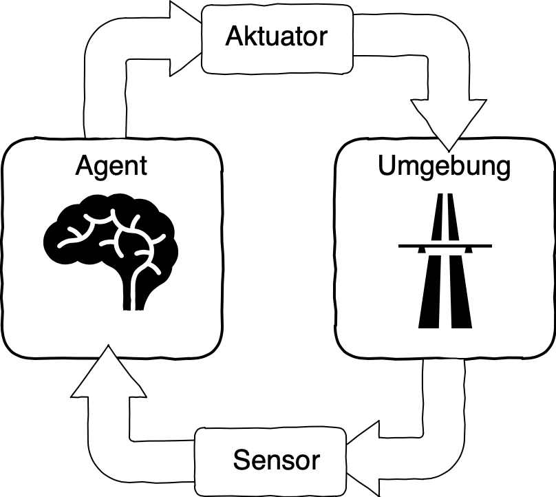
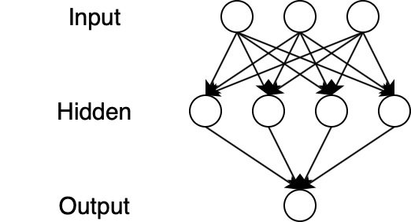
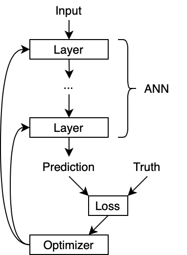
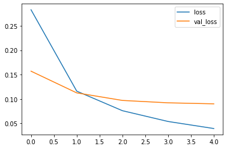

# Künstliche Intelligenz, Machine Learning, Deep Learning - Herausforderungen und Chancen für Ihr Unternehmen!

© 2020 Dr. Tristan Behrens, [https://ai-guru.de](https://ai-guru.de)

## Über Dr. Tristan Behrens

- Founding Member bei [The AI Guild](https://www.theguild.ai).

- Selbstständiger [Hands-On Advisor](https://ai-guru.de) für Artificial Intelligence, Machine Learning, Deep Learning und Data Science.

- Fünf Jahre IT-Berater in der Automobilindustrie in Festanstellung, zuletzt Topic Owner Künstliche Intelligenz im Porsche Digital Lab Berlin.

- Promotion in Künstlicher Intelligenz, Diplom in Informatik.

## 1. Künstliche Intelligenz, Machine Learning, Deep Learning

Was beobachten wir grad?

- Blue-Collar-Revolution: Maschinen übernehmen mechanische Arbeiten. Manuelle Arbeiten werden zunehmend automatisiert. Die größten Schritte waren in der Vergangenheit.
- White-Collar-Revolution: Maschinen übernehmen kognitive Arbeiten. Die größten Schritte sind jetzt.

Im Augenblick werden häufig drei Begriffe benutzt, oft auch synonym. Diese drei Begriffe sind:

- Künstliche Intelligenz,
- Machine Learning und 
- Deep Learning.

Im Folgenden bemühen wir uns um eine Begriffklärung.

### 1.1. Der Begriff der Künstlichen Intelligenz

Das *Dartmouth Summer Research Project on Artificial Intelligence* war ein Workshop, der 1956 in den USA stattfand. Dieses Ereignis wird von vielen Experten als er Moment verstanden, in dem die KI begründet wurde.

Die Künstliche Intelligenz ist ein weites Feld und damit schwer zu definieren. Es gibt eine Vielzahl an Definitionen die sich überschneiden und auch unterscheiden. Im Folgenden finden sich zwei.

**Definition 1:** Die Künstliche Intelligenz ist die wissenschaftliche Disziplin, welche sich mit künstlichen Entitäten befasst, welche

- menschlich denken, 
- rational denken,
- menschlich handeln oder 
- rational handeln.

**Definition 2:** Die Künstliche Intelligenz ist die Wissenschaft von den intelligenten Agenten. Ein intelligenter Agent ist eine autonome Entität, welche mit einer Umgebung interagiert und dort ihr Performanzmaß optimiert. 

Eine wichtige Unterscheidung ist die zwischen schwacher und Starker KI.

- *Schwache KIs* meistern konkrete Anwendungsprobleme. Sie unterstützen menschliches Denken und Handeln in einzelnen Bereichen.

- *Starke KIs* sind intelligente Agenten, welche auf Augenhöhe mit Menschen zusammenarbeiten.

**Bemerkung:** Ab jetzt meinen wir mit KI nur schwache KI.

### 1.2. Bereiche der Künstlichen Intelligenz

Aktuell redet man von fünf Säulen der Künstlichen Intelligenz. Diese sind:

- *Logisches Schließen:* Wissensrepräsentation und Ableitung neues Wissens mit logischen Formeln und logischem Schließen.
- *Suchen:* Suchalgorithmen und ihre Anwendungsfälle.
- *Planen:* Suchen mit Ziel- und Problemformulierung. Idealerweise wird aus beidem ein ausführbarer Plan abgeleitet.
- *Optimierungsmethoden:* Beispiele sind heuristische Suchverfahren und evolutionäre Algorithmen.
- *Approximationsmethoden:* Maschinelles Lernen, insbesondere Deep Learning.

Mit Machine Learning und insbesondere Deep Learning haben wir heute die größte Reichweite.

**Bemerkung:** Ab jetzt meinen wir mit Künstliche Intelligenz nur Maschinelles Lernen.

[Quelle](https://de.wikipedia.org/wiki/Künstliche_Intelligenz#Methoden)

### 1.3. Machine Learning

Der Begriff Machine Learning wurde 1959 geprägt. Heute verstehen wir darunter die Generierung von Wissen aus Erfahrung. Das bedeutet, dass wir mit Methoden des Machine Learning in der Lage sind, aus Daten Regeln abzuleiten um damit Probleme zu lösen. Üblicherweise kommt im Machine Learning eine von Menschen entwickelte Feature Extraction zum Einsatz. Diese kann beliebig kompliziert sein.

Das Machine Learning wird üblicherweise in drei Kernbereiche aufgeschlüsselt. Diese überschneiden sich:

- *Überwachtes Lernen:* Inputs und Outputs, z.B. Bilder und Labels (Beispiel: Katzen und Hunde).
- *Unüberwachtes Lernen:* Nur Inputs, Clustering, Representation Learning.
- *Bestärkendes Lernen:* Sensoren und Aktuatoren, Lernen über ein Belohnungssignal.

In der Regel unterscheidet man zwischen zwei Problemlösungsansätzen:
- *Klassifikation:* Einorden von Datenpunkten in verschiedene Klassen. Oft mit einer vorgegebenen Anzahl an Klassen.
- *Regression:* Vorhersage einer Ausgabegröße auf Basis mehrerer Eingabegrößen.

Im Machine Learning gibt es eine Vielzahl ein Algorithmen. Abhängig von Problemdefinition und Datenmenge muss man unterscheiden, welche am Besten eingesetzt werden können. Beispiele sind:

- *K-Nearest Neighbors:* Ist ein einfacher Algorithmus. Er ist parameterlos. Trainingsbeispiele werden nur gespeichert. Eine Ergebnisklasse ergibt sich aus einer Mehrheitsentscheidung der k nächsten Nachbarn.
- *Support Vector Machines:* Wird eingesetzt für Klassifikation und Regression. Intuitiv gesprochen werden hier Trenngeraden mit möglichst großer Randgröße gesucht. Funktioniert nur mit linear trennbaren Klassen.
- *Decision Trees:* Hier werden Entscheidungsregeln gelernt. Vergleichbar mit dem berühmten If-Then-Else aus der Softwareentwicklung. Inferenz ist Abstieg im Baum.
- *Random Forests:* Lernt wortwörtliche Wälder aus mehreren unkorrelierten Entscheidungbäumen um die Vorhersage zu verbessern.
- *Naive Bayes:* Basiert auf dem Satz von Bayes (Umkehrung von Schlussfolgerungen). Wird zum Beispiel für selbtlernende Spamfilter benutzt.
- *Linear Regression:* Hier wird intuitiv gesprochen versucht, eine gerade Linie durch die Daten ziehen.
- *Logistic Regression:* Hier wird intuitiv gesprochen versucht, die Daten mit einer nichtlinearen Funktion abzudecken (Sigmoid).
- *Artificial Neural Networks:* Hier konstruiert und trainiert man Netze aus künstlichen Neuronen. Gewichte zwischen den Neuronen werden gelernt. Es kommt ein Lernalgorithmus zum Einsatz.

Üblicherweise wird im Machine Learning sehr viel Energie in eine von Hand gefertigte Feature Extraction investiert. Feature Extraction meint das Ableiten von neuen Daten aus Eingabedaten mit dem Ziel kompakter und nicht redundant zu sein.

Aktuell:

- Deep Learning liefert neue State-of-the-Art-Ergebnisse in vielen - wenn nicht sogar den meisten - Domänen.
- Deep Learning dominiert mindestens Image Processing und Natural Language Processing.
- Deep Learning ist grad auf dem Weg Time Series Analysis abzudecken.  

*Bemerkung:* Ab jetzt meinen wir mit KI hauptsächlich Künstliche Neuronale Netze.

### 1.4. Künstliche Neuronale Netze und Deep Learning

Künstliche Neuronale Netze sind Netzwerke aus Künstlichen Neuronen. Zur Historie ist folgendes zu sagen:

- Neuronale Netze stammen aus den frühen 1940er Jahren.
- Das erste Künstliche Neuronale Netz war das berühmte McCulloch-Pitts-Neuron, welches ausschließlich binäre Daten verarbeiten konnte.
- Künstliche Neuronale Netze sind angelehnt an biologische Neuronale Netze. Sie sind aber nur ein Modell.
- Künstliche Neuronale Netze kamen beinahe zeitgleich mit den ersten programmierbaren Computern auf.

Mathematisch gesehen bilden Neuronale Netze Eingabedaten über eine Vielzahl mathematischer Operationen auf Ausgabedaten ab. Die mathematischen Operationen sind variabel und werden in einer sogenannten Trainingsphase gelernt.

Im Folgenden finden sich ein paar wichtige Begriffe:

- *Eingabeschicht, versteckte Schicht, Ausgabeschicht:* Sind Elemente der Netzwerkarchitektur die die Topologie eines Neuronalen Netzes bestimmen.
- *Trainierbare Parameter, Gewichte:* Die sind die sogenannten Freiheitsgrade. Intuitiv gesprochen sind das die Variablen der erlernbaren mathematischen Operationen.
- *Loss-Funktion:* Mit der Fehlerfunktion kann die Qualität eines Neuronalen Netzes bewertet werden.
- *Optimierungsalorithmus:* Trainiert auf den gegebenen Daten und optimiert die trainierbaren Parameter mit Blick auf die Loss-Funktion.
- *Fully Connected Neural Networks:* Jedes Eingabeneuron ist mit jedem Ausgabeneuron über ein erlernbares Gewicht verbunden.
- *Convolutional Neural Networks:* Hier werden Filter trainiert, welche gleichzeitig auf alle möglichen Positionen in den Eingabedaten angewandt werden. Sie werden insbesondere in der Bildverarbeitung benutzt.
- *Recurrent Neural Networks:* Hiermit sind Neuronale Netzwerke gemeint, die Rückkopplungen erlauben. Damit kann eine Form von Gedächtnis erlernt werden. Sie werden üblicherweise für sequentielle Daten, etwa Texte oder Zeitreihen benutzt.

Neuronale Netze werden zunächst entworfen (Topologie) und dann mit Daten trainiert. Hier hat es sich bewährt sowohl mit Trainings- als auch mit Testdaten zu arbeiten. Mit den Trainingsdaten trainiert man das Modell und sorgt dafür, dass es das gegebene Problem überhaupt lösen kann. Mit den Testdaten hingegen stellt man fest, wie gut das trainierte Neuronale Netz mit neuen beziehungsweise unbekannten Daten umgehen kann.

Was ist der Unterschied zwischen Neuronalen Netzen und den tiefen Neuronalen Netzen, also dem sogenannten Deep Learning?

Tiefe Neuronale Netze sind Neuronale Netze mit mindestens einer versteckten Schicht. Jede Schicht ist in der Lage eine eigene Feature Extraction zu lernen. Es werden sehr viel weniger handgefertigte Feature Extractions eingesetzt. Idealerweise keine.

[InceptionV3](https://arxiv.org/abs/1512.00567) ist ein Beispiel für ein tiefes Neuronales Netzt mit vielen versteckten Schichten. Es hat fast 160 Schichten und in Summe fast 24 Millionen trainierbare Parameter.

[Bildquelle](https://ai.googleblog.com/2016/03/train-your-own-image-classifier-with.html)

### 1.5. Warum Deep Learning jetzt?

Warum ist Deep Learning gerade jetzt die erfolgreichste Technologie in der Künstlichen Intelligenz? Warum ist die maßgeblich in der Ära der Implementierung?

- *Grundsolides, wissenschaftliches Fundament:* Das Thema ist seit mehreren Jahren erforscht. Es gab viele große Durchbrüche. Weitere große Durchbrüche sind grad nicht absolut nötig.
- *Daten:* Es stehen sehr viele Daten zur Verfügung und es ist heute vergleichsweise einfach, neue Daten zu sammeln.
- *Hardware:* GPUs sind sehr verfügbar, sowohl on-premise als auch in der Cloud.
- *Software:* Alles nötige zum Bau eigener Prototypen und Produkte ist verfügbar. Vieles ist quelloffen.
- *Upskillling:* Durch die Verfügbarkeit von Deep Learning Platformen, Lernplatformen, Literatur und Experten ist es vergleichsweise einfach ein Upskilling durchzuführen.

*Bemerkung:* Insgesamt beschäftigen wir uns mit schwacher KI in Form von Machine Learning und insbesondere Deep Learning.

## 2. Anwendungsfälle

In Machine Learning und Deep Learning gibt es sehr viele Anwendungsfälle. Im Folgenden werden exemplarisch ein paar wenige aufgelistet. Die Liste ist unvollständig, gibt aber eine Richtung vor und darf als Inspirationsquelle dienen.

### 2.1. Chatbots

Chatbots sind Kommunikationsassistenten. Sie sind häufig textbasiert und für spezielle Szenarien konzipiert. Sie zählen zu den schwachen KIs und verwenden oft handgefertigte - also nicht gelernte - Entscheidungsbäume, um mit gut designten strukturierte Dialogen Prozesse zu optimieren, die auf der Interaktion von Individuuen basieren. Häufig werden Werkzeuge aus dem Natural Language Processing und Natural Language Understanding benuzt, welche wiederum oft auf Tiefen Neuronalen Netzen basieren. Das Training von diesen Netzen ist in der Regel nicht Teil der Entwicklung eines Chatbots. Auch herrscht insbesondere kein Anspruch, den Turing-Test zu bestehen.

### 2.2. Automatische Handschriftenerkennung

Automatische Handschriftenerkennungen finden unter anderem im Bank- und Postwesen ihren Einsatz.
Die Forschungsgruppe in den AT&T Bell Laboratories um Yann LeCun entwickelte 1989 in Kooperation mit dem US Postal Service ein System zur Automatischen Erkennung von Postleitzahlen. Hier kamen tiefe Neuronale Netze, insbesondere Convolutional Neural Networks zum Einsatz. Der berühmte MNIST-Datensatz ist diesem Anwendungsfall zuzuordnen und erfreut sich konstanter Beliebtheit als Hello-World im Machine Learning.

[Quelle](http://yann.lecun.com/exdb/mnist/)
[Quelle](http://yann.lecun.com/exdb/publis/pdf/lecun-90e.pdf)

### 2.3. Machine Learning Applications for Data Center Optimization

Jim Gao (damals Google) veröffentlichte im Jahre 2014 ein Papier. Inhalt war ein Ansatz zur Steigerung der Energieeffizienz in einem Google Data Center. Basis der Optimierung war ein tiefes Neuronales Netz mit fünf Schichten. Die Datengrundlage bestand aus 19 Messgrößen mit jeweils fast 185K Messungen. Das waren Daten gesammelt über einen Zeitraum von knapp zwei Jahren mit einer Abtastrate von 5 Minuten (etwa 13 MB als Fließkommazahlen).

[Quelle](https://link.springer.com/chapter/10.1007%2F978-3-319-95273-4_5)

### 2.4. Predictive Maintenance mit Audio Daten

Im Porsche Digital Lab Berlin wurde 2018 evaluiert wie weit sich Deep Learning in der Predictive Mainenance einsetzen lässt. Ziel der Predictive Mainenance ist im allgemeinen die Vorhersage, wann ein Ereignis eintritt. Die kann zum Beispiel ein vorhergesagter Fehlerzustand einer Maschine sein. Ist das Predictive Mainenance System gut genug, können damit feste und gegebenenfalls teure Wartungsintervalle durch eine dynamische Wartung abgelöst werden. In Berlin wurde gezeigt, dass man mit vergleichsweise wenigen Klang-Daten überzeugende Prototypen etablieren kann.

[Quelle](https://link.springer.com/chapter/10.1007%2F978-3-319-95273-4_5)

### 2.5. Mobile Robotik

Im Jahre 2016 veröffentlichte die kalifornische Firma Nvidia ein Papier mit dem Titel "End to End Learning for Self-Driving Cars". Der Inhalt ist ein Ansatz zum Autonomen Fahren. Der Ansatz ist grundlegen datenbasiert. Auf Basis von weniger als 100 Fahrstunden wurde ein tiefes Neuronales Netz trainiert, welches richtungsweisende Ergebnisse erzielte. Das Autonome Fahren ist hier als ein Beispiel aus der mobilen Robotik zu verstehen.

[Quelle](https://arxiv.org/pdf/1604.07316.pdf)

### 2.6. Real-Time Object Detection

YOLO ist der Name einer Familie von tiefen Neuronalen Netzen aus dem Image Processing. Mit den Vertretern der Familie ist der Benutzer in der Lage in Echtzeit bis zu 9000 verschiedene Objekte mit hoher Genauigkeit auf Standbildern zu erkennen. Es ist möglich sowohl die Klasse eines Objekts, als auch dessen Position auf dem Bild zu bestimmen. Darüber hinaus funktionieren die Neuronalen Netze insbesondere auch mit mehreren Objekten pro Bild.

[Quelle](https://arxiv.org/pdf/1612.08242v1.pdf)

### 2.7. Natural Language Processing

BERT ist ein Sprachmodell von Google und existiert als tiefes Neuronales Netz. Seine Veröffentlichung im Jahre 2018 wird von vielen Experten als Meilenstein in der Verarbeitung natürlicher Sprache gewertet. Mit BERT und verwandten Architekturen wurden seitdem viele Benchmarks in mindestens 11 Problemstellungen im Natural Language Processing verbessert.

[Quelle](https://arxiv.org/abs/1810.04805)

## 3. Wie setzt man erfolgreich Anwendungsfälle mit Machine Learning und Deep Learning um?

1. Problem identifizieren &rarr; Kreativworkshops.
2. Daten erschließen &rarr; Data Science, Mechanical Turk.
3. Daten-Vorverarbeitung &rarr; Data Science.
4. Modell-Design &rarr; Machine Learning.
5. Hyperparameter optimieren &rarr; Machine Learning.
6. Model trainieren &rarr; Machine Learning.
7. Model evaluieren &rarr; Machine Learning.
8. Zurück zu 4, 3, 2, oder 1.
9. Ausliefern und Pflegen &rarr; DevOps.

### 3.1. Design Thinking

Im Design Thinking werden die Methoden von Industriedesignern in Bereichen und auf Probleme angewandt, die über das bloße Aussehen eines Produkts hinausgehen. Hier ist insbesondere die User Experience im Vordergrund. Das Design Thinking selbst hat eine flexible Definition.

- Im Design Thinking geht es um die Identifikation von Problemen und deren Lösungen.
- Das Design Thinking selbst ist endbenutzerorientiert. Das heißt, dass der Benutzer der mit dem Produkt umgeht fokussiert wird.
- Das Design Thinking bietet einen umfassenden Werkzeugkasten mit dem oft spielerisch neue Ideen entwickelt werden.
- Das Design Thinking ist ein Mittel mit dem man vom kreativen Prozess in Innovation übergehen kann.
- Das Design Thinking etabliert ein die Kreativität förderndes Umfeld.
- Im Design Thinking profitiert man von der Diversität bei den Teilnehmern.
- Design Thinking fördert die gemeinsame Erarbeitung einer Fragestellung im Team.

Die Phasen vom Design Thinking:

- *Verstehen:* Welches Problem liegt vor und welche Zusammenhänge herschen?
- *Beobachten:* Analyse der Zielgruppe. Wünsche und Bedürfnisse werden aufgedeckt und untersucht.
- *Synthese:* Gesammelte Eindrücke werden komprimiert. Es werden Erkenntnisse generiert.
- *Ideen finden:* Alle Ideen sammeln, alle Ideen in Clustern anordnen, die besten Idee(n) identifizieren.
- *Prototypen:* Es werden Prototypen entwickelt um die Idee(n) erlebbar zu machen. Prototypen werden mit geringem Aufwand validiert.
- *Testen:* Die Prototypen werden mit Endkunden und Stakeholdern weiter validiert. Ist ein Prototyp tauglich wird implementiert.

Design Thinking ist allgemein für diverse Fragestellungen einsetzbar. In Bezug auf Künstliche Intelligenz kann es zielführend sein, die folgenden Fragen zu stellen und zu beantworten:

- Welche Tätigkeiten wiederholen sich oft und kosten in Summe viel Zeit?
- Bei welchen dieser Tätigkeiten könnte eine Automatisierung zu Einsparungen führen?
- Welche Tätigkeiten im Unternehmen skalieren nicht mehr?
- Liegen im Unternehmen Daten vor und vermutet man, dass man mit der Lösung von Problemen auf diesen Daten neue Produkte oder einen Wettbewerbsvorteil bekommen kann?

[Quelle](https://de.wikipedia.org/wiki/Design_Thinking)

### 3.2. Agile Methoden insbesondere Scrum

Besonders in der heutigen Zeit ist es entscheidend, zu entwickelnde Systeme schnell zum Einsatz zu bringen. Hier steht insbesondere das Minimum Viable Product im Vordergrund. Mit ihm entwickelt man entweder ein neues Produkt oder eine neue Version, um mit dem kleinsten Aufwand den größten Lerneffekt zu erzielen. Insbesondere bedeutet dies einen Marktvorteil, denn statistisch gesehen florieren die Unternehmen, welche schnell am Markt sind und schnell auf dem Mark agieren, gegenüber denen, die sich viel Zeit mit Planen und Umsetzen lassen. Um das erste zu erreichen, bieten sich agile Methoden an. Insbesondere Scrum ist hier zu nennen.

Agile Methoden basieren auf dem Agilen Manifest. Dieses besagt:

- Individuen und Interaktionen stehen über Prozessen und Werkzeugen
- Funktionierende Software steht über einer umfassenden Dokumentation
- Zusammenarbeit mit dem Kunden steht über der Vertragsverhandlung
- Reagieren auf Veränderung steht über dem Befolgen eines Plans

Agile Methoden im Allgemeinen und Scrum im Speziellen erhöhen die Flexibilität und Transparenz insbesondere im Vergleich zu älteren Methoden wie etwa Wasserfall.
Agil heißt eine iterative beziehungsweise inkrementelle Vorgehensweise. Damit wird Bürokratie reduziert, was wiederum die Anpassungsfähigkeit an neue Umstände maximiert.

In Scrum arbeitet man üblicherweise in Sprints. Sprints dauert zwischen zwei und vier Wochen. Am Ende jedes Sprints gibt es ein Deliverable. Dies ist das Produktinkrement und stellt das nächste MVP da. Im Scrum wird ein sogenanntes Backlog kontinuierlich gepflegt. Das Backlock ist die Antwort auf die beiden Fragen "Was ist zu tun?" und "Was wir gerade gemacht?". Klar abgegrenzye Rollen, feste Ereignisse/Rituale, ausdruckstartke Artefakte und ein überschaubarer Werkzeugkasten machen Scrum aus.

[Quelle](http://theleanstartup.com)
[Quelle](https://www.scrumalliance.org/about-scrum/overview)
[Quelle](https://de.wikipedia.org/wiki/Agile_Softwareentwicklung)

### 3.3. Daten(vor)verarbeitung und Mechanical Turk

Der Begriff Mechanical Turk ist angelehnt an den sogenannten Schachtürken. Letzterer war ein scheinbarer Schachrobotter aus dem achtzehnten Jahrhundert in dem aber tatsächlich ein menschlicher Spieler versteckt war. Heute ist der Mechanical Turk in der Data Science eine Tätigkeit oder ein käufliche Dienst.

Die Qualität von Modellen aus dem Machine Learning ist fast ausschließlich von der Qualität und der Quantität an Trainingsdaten abhängig. Erfahrunggemäß wird im Machine Learning überproportional viel Zeit für das Sammeln, das Bereinigen, die Vorverarbeitung und die Kodierung von Daten aufgebracht. Als grobe Daumenregen stehen üblicherweise 80% Datenverarbeitung 20% Modellierung und Training gegenüber. 

Es werden häufig eigene dedizierte Data-Pipelines und Tools dafür entwickelt. Insbesondere das Data-Labelling, also das Versehen von Eingabedaten mit Ausgabedaten kann sehr zeitintensiv sein. Die Bereitstellung von Data-Pipelines und Tools und deren Benutzung ist Aufgabe des Data Engineers.

[Quelle](https://www.mturk.com)

### 3.4. Modellierung und Hyperparameter Optimization

Sind Daten in ausreichender Qualität und Quantität vorhanden, wird als nächstes ein Model definiert. Im Deep Learning ist damit ein Neuronales Netz in Form seiner Topologie gemeint. Darüberhinaus werden Hyperparameter festgelegt. Damit sind variable Größen gemeint, die auch einen Einfluss auf die Qualität des Models haben. Etwa die Trainingsdauer, die Art der Datenkodierung oder das Größenverhältnis zwischen Trainings- und Testdaten. Insgesamt sind Hyperparameter die Freiheitsgrade, die nicht Variablen des Modells selbst sind.

Die Aufgabe die Parameter der Modells und die Hyperparameter richtig einzustellen liegt beim Machine Learning Engineer.

### 3.5. DevOps

Das Wort DevOps setzt sich zusammen aus Development und Operations. Hier werden Softwareentwicklung und Systemadministration, also Development und IT Operations, integriert. Durch die Integration beider Bereiche gelangt man idealerweise zu einer erhöhten Qualität, sowohl auf Produkt- als auch auf Service-Ebene. Auch wird damit die Geschwindigkeit in der Entwicklung und der Auslieferung erhöht.
Continuous Integration ist das Werkzeug welches massiv dazu beiträgt. Die Phasen von Continuous Integration sind:
- *Code*: Implementierung.
- *Build*: Übersetzung von Quelltext nach lauffähiger Software. 
- *Test*: Qualitätssicherung der potentiellen Liefergegenstands.
- *Package*: Paketierung.
- *Release*: Veröffentlichung und Bereitstellung der Inkrements.
- *Configure*: Konfiguration der Software inklusive Frontend, Middlewares und Backend.
- *Monitor*: Logging zur Laufzeit.

Wichtig ist die grundlegende Annahme, dass die meisten Schritte in der Continuous Integration automatisiert sind.

## 4. Machine Learning im Unternehmen 

Der mögliche Einsatz von Machine Learning im Unternehmen bietet Chancen, Herausforderungen und Gefahren.

### 4.1. Chancen

- Verbesserung von bestehenden Services/Produkten: So kann Machine Learning die Genauigkeit von bestehenden Diensten erhöhen oder die Automatisierbarkeit von Prozessen möglich machen.
- Optimierung interner Abläufe: Durch Klassifizierungen und Vorhersagen auf den eigenen Daten und Prozessen können diese gegebenenfalls optimiert werden.
- Entwicklung neuer Produkte: Machine Learning mit seinem datenorientierten Ansatz erschafft neue Produkt und Projektmöglichkeiten
- Erhöhung der Kreativität: Durch eine vom Machine Learning möglich gemachte Automatisierung, kann bei vielen Mitarbeitern Zeit befreit werden. Diese Zeit kann dann für anspruchsvollere und insbesondere für kreativere Arbeiten benutzt werden.
- Verbesserung von Entscheidungen: Durch den daten-orientierten Aspekt und der Tatsache, dass Machine Learning sehr viel schneller als jeder Mensch Daten auswerten kann können mehr Daten in kürzerer Zeit zur Entscheidungsfindung heran gezogen werden.
- Personalreduktion (Achtung!): Dies ist ein kritischer Punkt. Idealerweise werden Mitarbeiter im Unternehmen auf andere Positionen gesetzt, wenn ihre üblichen Tätigkeiten automatisiert werden. Insgesamt eine Chance Personal zu halten und durch neue Tätigkeiten zu entfalten. 

### 4.2. Herausforderungen

- *Ist mehr Forschung nötig?* - Nein. Obwohl im Machine Learning Forschung ein wichtiger Teil ist, ist heute nicht mehr Grundlagenforschung nötig. Viele Anwendungsfälle die heute identifiziert werden, sind mit bereits etablierten, also erforschten, Methoden umzusetzen. Insgesamt haben wir schon vor einer Weile das Zeitalter der KI-Implementierung angetreten.

- *Muss neue Spezial-Software implementiert oder erworben werden?* - Nein. Es gibt eine Vielzahl an Softwarepaketen für Data Science, Machine Learning und Deep Learning. Viele davon sind frei, verfügbar, quelloffen und werden kontinuierlich weiter entwickelt. Dazu zählen etwa TensorFlow, Scikit-Learn, Pytorch, Keras, Deeplearning4j, Apache MXNet und weitere. Diese Liste ist nicht erschöpfend.

- *Braucht man Spezial-Hardware die eventuell sogar schwer zu erlangen ist?* Nein. Üblicherweise kommen GPUs zum Einsatz, die man sich auf mehreren Wegen zu eigen machen kann. Zunächst muss man zwischen Inferenz und Training unterscheiden. GPUs müssen nicht unbedingt zur Inferenz, also wenn das Produkt im Einsatz ist, benutzt werden. So laufen etwa tranierte Neuronale Netze nach dem Training auf eingebetteter Hardware oder handelsüblichen CPUs ohne dass eine spezielle Beschleunigung nötig ist. Bein Training ist eine GPU oft anzuraten, weil hier die Beschleinigung an spürbarsten sein kein. Hier muss man sich entscheiden für den Einsatz von entweder Low-, Middle-, oder Big-Range-Hardware. Und ob man eher eigenen Hardware anschafft (on premise) oder Hardware mieted (on the cloud). Gerade bei letztderem gibt es viele gute Anbieten, deren Kosten überschaubar sind, etwa AWS und Microsoft Azure.

- *Ist es sehr schwierig Machine-Learning-basierte Lösungsansätzen zu identifizieren?* Eher nein. Wie bereits erläutert ist die Entfaltung von Kreativität zu Innovation ein erlernbares Handwerk. Auch erlernbar ist das Wissen, welches nötig ist um die Machbarkeit und den etwaigen Aufwand von Machine-Learning-Projekten zu bewerten und abzuschätzen. Eine Erweiterung des internen Skillsets um diese Fähigkeiten ist möglich und eher auch notwendig.

- *Blockieren rechtliche Aspekte den Fortschritt und die Umsetzbarkeit?* Eher nein.
Wem gehören die Daten?
Wie stehen Daten und Modellen in Beziehung?
Was kann man an Modellen schützen?
Beispiel Gesichtserkennung.

- *Muss das Mindset des Unternehmens geändert werden_* Ja. Die technischen Herausforderung im Machine Learning werden oft von Herausforderungen im Mindset von Unternehmen in Schatten gestellt. Das technische Upskilling ist oft im Aufwand gegenüber einer nötigen Veränderung der Firmenmentaliät vernachlässigbar. Die Anpassung an neue Möglichkeiten, die Etablierung moderner Methoden wie etwa Scrum und Design Thinking, die Ablösung von etablierten und starren Strukturen und Prozessen und die Neuorientierung in Richtung Daten sind die größten Herausforderungen. Dem gegenüber verblasst das Machine Learning selbst.

- *Sind Daten eine Herausforderung?*  Ja. Ohne Daten kann keine KI trainiert werden. Wenn Daten vorhanden sind, müssen sie oft aufbereitet werden. Dies kann sehr aufwendig werden. Sind Daten noch nicht vorhanden, so müssen sie mühsam gesammelt werden.
 

### 4.3. Gefahren?

- *KI-Machtübernahme.* Nein. Keine Gefahr für Ihr Unternehmen. Die Reichweite schwacher KI ist sehr begrenzy und starke KI ist alles andere als in greifbarer Nähe.
- *Disruption und ihre Auswirkungen.* Ja. Definitiv etwas, was als mögliche Bedrohung in Betracht gezogen werden sollte. In einer Zeit in der eine hohe Flexibilität wichtig ist und wegen der schnellen und sich weiterhin beschleunigenden technologischen Veränderungen eine kurze Reaktionszeit gefragt ist, läufen viele bereits etablierte Unternehmen Gefahr, unwiederuflich den Anschluss zu verlieren.
- *Veränderung des Arbeitsmarkts.* Eher nein. Der Arbeitsmarkt kann sich in den nächsten zwei Jahrzehnten massiv aufgrund der Fortschritte in der Automatisierung durch KI verändern. Aufgrund von Erfahrungen mit historischen Veränderungen in der Vergangenheit ist jedoch davon auszugehen, dass das Szenario einer Massenarbeitslosigkeit eher abwegig ist.
- *Fachkräftemangel.* Eher ja. Heute ist der Bedarf an zum Beispiel Data Scientists und Machine Learning Engineers massiv vorhanden und es ist davon auszugehen, dass der Bedarf besonders in den nächsten Jahren eher steigen als sinken wird.

## 5. Wie können Sie Ihr Unternehmen auf den Einsatz von KI zubewegen?

Insgesamt sind die folgenden Maßnahmen zu empfehlen:

- Bewusste, achtsame und zielgerichtete digitale Transformation im eigenene Unternehmen.
- Graduelle Veränderung des Mindsets und der eigenen Unternehmenskultur.
- Annehmen moderner Methoden im Dienste von Kreativitäd und Produktivität, etwa Design Thinking und Scrum.
- Regelmäßige Kreativworkshops zur Identifikation von Anwendungsfällen mit technischer Begleitung, vorzugsweise mit Gruppen hoher Diversität.
- Fachliche und Technische Workshops zum Upskilling der eigenen Mitarbeiter. Damit sind alle Bereiche (Management, Operations, Sales, HR, Engineering et cetera) gemeint.
- Setzen des gesunden Ziels: Die Zeitnahe Umsetzung eigener Prototypen mit den eigenen Daten.